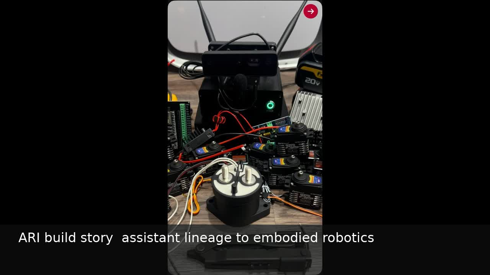
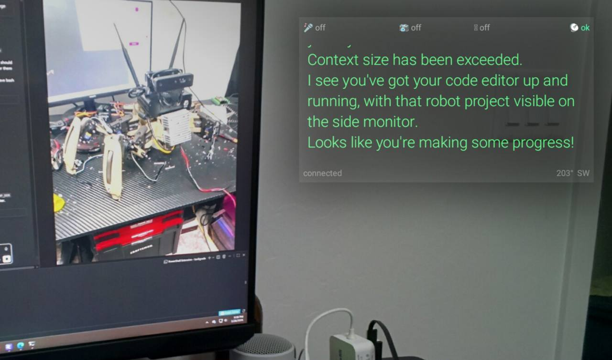
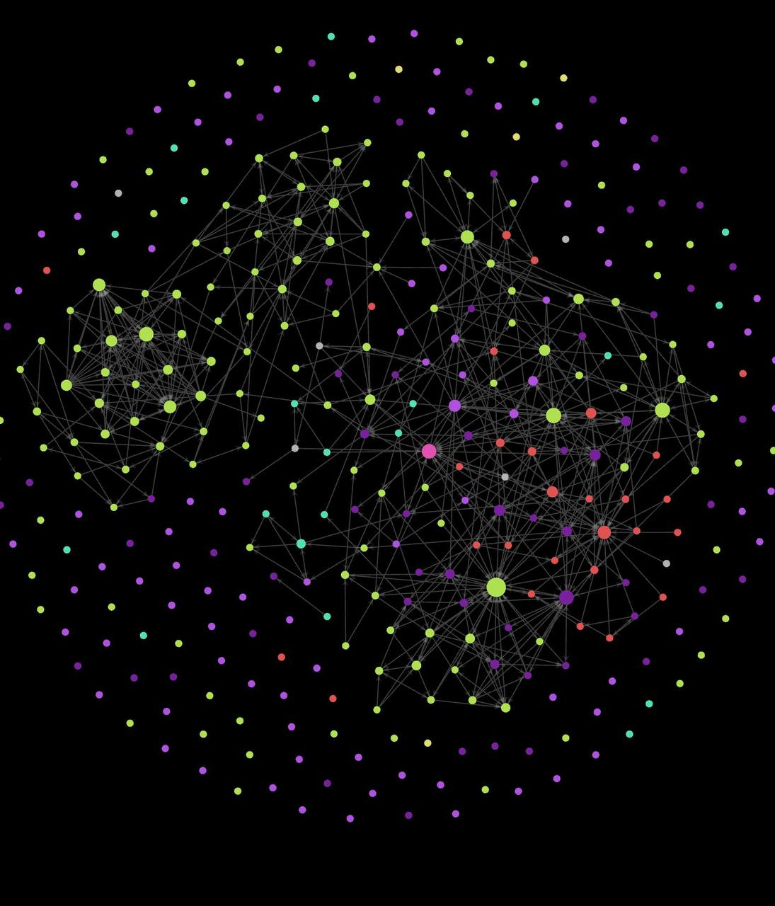

# ARI: From Local AI Assistant to Embodied Robotics

ARI is a cross-domain engineering program: first a local AI assistant lineage, then a persistent software system grounded in knowledge workflows, and finally an 18-DOF hexapod that connects software orchestration to CAD, fabrication, electronics, embedded control, simulation, and safety-gated autonomy research.

Watch the silent captioned build story: [media/portfolio/ari-build-story.mp4](media/portfolio/ari-build-story.mp4).

This repository is a public, sanitized portfolio snapshot. It is not the full operational tree, does not include checkpoints or private run directories, and cannot command hardware.

## Selected Collaboration Evidence

### Wearable Assistant Interface

A custom wearable application and desktop bridge demonstrated sensor telemetry, push-to-talk audio, local speech recognition, spoken replies, camera-to-multimodal interpretation, and image delivery back to the wearable while preserving one assistant context.

The photograph shows a prototype display with an assistant response grounded in a camera view of the robot/code workbench. See [docs/wearable-assistant.md](docs/wearable-assistant.md) for the public-safe evidence note.

## Five-Minute Portfolio

### 1. June 2025: SARA

SARA began in June 2025 as a custom Python assistant wrapper built before Hermes Agent existed in this project. SARA no longer has surviving source in this repository; it is a historical source no longer retained after the project moved from the earlier assistant wrapper to ARI.

That makes SARA an honest historical milestone, not a source-backed artifact. This portfolio does not invent SARA screenshots, code, metrics, or detailed capabilities.

### 2. ARI software system

SARA's lessons evolved into ARI: a persistent assistant grounded in an Obsidian vault and later integrated with Hermes Agent for memory, tool use, messaging, voice, and bounded coding delegation. Public documentation stays at the architectural level and omits vault content, paths, IDs, endpoints, credentials, private prompts, and operational configuration.

#### Thinking Architecture

This graph visualization represents the linked knowledge and memory structure that supports retrieval and reasoning across the ARI software architecture.

### 3. ARI physical robot

The physical robot came third. ARI expanded into an 18-DOF hexapod with CAD/fabrication work, actuator and electronics integration, ESP32-class servo control, deterministic gait, Isaac simulation, deployable-observation design, evaluator gates, and simulator-only locomotion evidence.

## Implemented Components

- Software architecture: the SARA-to-ARI progression, persistent assistant architecture, Hermes Agent integration boundaries, memory/tool/messaging/voice concepts, and bounded coding-delegation workflow.
- Mechanics, CAD, and fabrication: the 18-DOF hexapod concept, leg layout, prototype iteration, current frame integration, and serviceable electronics layout.
- Actuator and electronics integration: servo wiring, power/control stack bring-up, foot-contact sensing concepts, and controller placement.
- ESP32 and servo control: bounded joint-command work and deterministic scripted gait for the physical robot.
- Deterministic gait: physical hardware coordination under scripted control. This demonstrates embedded actuation and timing, not a learned hardware policy.
- Isaac simulation: simulator assets and locomotion experiments used before any learned policy is considered for physical deployment.
- Observation and evaluator design: deployable-observation constraints, simulator gates, safety thresholds, and promotion criteria.
- Evidence and promotion decisions: separating physical scripted gait, early gait development footage, simulator-only learned locomotion, and non-promoted experiments.

## Build Timeline

- June 2025: SARA starts the local-assistant lineage. No surviving source is claimed.
- ARI assistant: persistent assistant architecture grows from SARA's lessons and later integrates with Hermes Agent.
- Concept sketches: leg assembly, linkages, and foot-contact ideas define the physical direction.
- Prototype 2: powered hardware validates the move from sketches to a working bench platform.
- Current model: mechanical layout, power/control stack, and ESP32-class servo integration mature.
- Early gait development: learning-to-walk footage shows gait exploration; the public artifact does not specify the controller.
- Scripted physical walk: deterministic hardware gait shows coordinated servo motion on the real robot.
- Run63 simulation: simulator-only legacy-axis locomotion evidence supports research without claiming physical-forward walking or hardware policy deployment.

## Selected Results

The conservative metric record is in [evidence/metrics.json](evidence/metrics.json).

- Physical platform: six legs and 18 total degrees of freedom.
- Hardware evidence: deterministic scripted physical gait on the current robot.
- August 3, 2026 correction: rendered simulator evidence exposed a frame-sign mismatch in the legacy Run63 handoff/trainer. The physical robot convention is body +X as forward, but the legacy evaluator treated URDF -X displacement as positive command-vx progress. Run63, Run64, Run104, and Run105 are therefore legacy -X simulator-locomotion evidence, backward relative to the physical chassis front, not physical-forward walking or speed evidence.
- Run63: canonical historical deployable-observation legacy-axis locomotion policy.
- Run64: 0.2704 m/s measured in simulation on a 0.45 m/s command with zero falls and contact match 0.9488, under the legacy -X evaluator axis only.
- Run94.8: scan-turn simulator qualification selected Run94.6 `model_11` for full +/-360 degree simulator-only qualification with zero falls.
- RunV4: force-drive zero-action simulator diagnostic completed 64 environments for 3,000 steps with zero true terminations.
- Run104: simulator-only continuation from the preserved verified Run63 deployable-observation actor completed 500 PPO updates across 2,048 parallel environments, totaling 24,576,000 transitions; update 100 was selected within the legacy-axis campaign, while update 500 was not promoted because it reduced legacy-axis displacement despite stable contacts. It is not a physical-forward champion.
- Run105: legacy-axis speed campaign completed 500 updates, but no candidate was promoted; the parent policy was retained, and the campaign is not reported as speed progress.
- Stage1 safe 0.25: reached 50 optimizer updates but is not promoted; the +0.05 m/s forward replay displaced about 0.00003036 m against a 0.005 m gate.
- August 3, 2026 RunV4 Stage-2: first end-to-end RunV4 Stage-2 PPO campaign genuinely executed in headless Isaac Lab. The pipeline completed 25 genuine optimizer updates across 64 environments with 24 steps per environment, produced a finite checkpoint, ran fixed-command evaluation, and cleaned up process/lock ownership. Capability did not pass: the fixed +0.05 m/s command produced approximately -0.000042 m mean forward displacement against the unchanged 0.005 m promotion gate, so it was not promoted.

## Capability Boundaries

The deterministic physical walk and learned simulator policies are separate capabilities. The physical gait is scripted and inspectable. Learned locomotion remains simulator-only in this snapshot.

Physical-forward learned locomotion capability is reopened pending +X-corrected retraining and validation. No learned policy is cleared for hardware.

Stage1 force-drive work is not promoted and is not cleared for hardware. Autonomous hardware motion is prohibited.

The August 3, 2026 first end-to-end RunV4 Stage-2 PPO campaign is also simulator-only and not promoted. It proves the real training, evaluation, and evidence loop can run end-to-end while refusing to promote a non-walker; it does not show RunV4 walking and is not cleared for hardware.

The public repository is intentionally sanitized. It excludes model checkpoints, private paths, credentials, machine-specific configuration, vault contents, and operational launch details.

## AI-Assisted Development Note

AI tools accelerated implementation, review, documentation, and comparison work. Human oversight was retained for architecture, physical integration, experiment design, safety thresholds, evidence interpretation, and promotion decisions.

## Repository Tour

- [docs/software-lineage.md](docs/software-lineage.md): SARA to ARI assistant to ARI robot.
- [docs/build-evolution.md](docs/build-evolution.md): visual robot timeline with honest captions.
- [docs/architecture.md](docs/architecture.md): hardware/simulation/control architecture.
- [docs/wearable-assistant.md](docs/wearable-assistant.md): public-safe wearable assistant collaboration evidence.
- [docs/engineering-process.md](docs/engineering-process.md): how runs are gated and reviewed.
- [docs/results.md](docs/results.md): measured results and non-promotions.
- [docs/safety-and-limitations.md](docs/safety-and-limitations.md): current boundaries.
- [docs/reproducibility.md](docs/reproducibility.md): what is reproducible from this public snapshot.
- [src/](src/): representative sanitized source examples.
- [config/](config/): representative sanitized configuration examples.
- [media/](media/): public physical-build and simulator visual evidence.
- [scripts/validate_public_repo.py](scripts/validate_public_repo.py): public-safety and completeness validator.

Suggested public GitHub description: `Public portfolio snapshot of ARI: local assistant lineage, 18-DOF hexapod hardware, embedded gait control, Isaac simulation, and safety-gated validation.`

License: MIT. Citation metadata is in [CITATION.cff](CITATION.cff).
