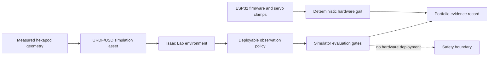

# ARI Hexapod Portfolio Snapshot

ARI is Brandon Tardi's 18-DOF hexapod robotics project: a six-legged platform with three actuated joints per leg, an embedded servo-control stack, and an Isaac Lab reinforcement-learning program used to test locomotion policies before any physical deployment. Brandon's role spans the full engineering loop: mechanical measurement, embedded control, simulation setup, policy training, evaluator design, evidence review, and safety gating.

This repository is a public, sanitized portfolio snapshot for review. It is not the full operational tree, does not include checkpoints or private run directories, and cannot command hardware.

Caption: simulator frame from the Run63 deployable-observation forward-walking capture. The matching MP4 is in [media/ari_run63_deploy_walk_0p25.mp4](media/ari_run63_deploy_walk_0p25.mp4).

## What Is Built

- Physical platform: six legs, 18 total degrees of freedom, hobby-servo actuation, measured leg geometry, foot-switch contact sensing, and ESP32-class embedded control.
- Embedded control: deterministic joint-space gait and safety clamps run separately from learned simulator policies.
- Simulation: Isaac Lab environments model the robot, contact, torque/velocity limits, sensor constraints, and PPO-based policy training.
- Deployable observation constraint: learned policies are evaluated against observations the robot can plausibly synthesize, such as IMU attitude/rate, commanded-target joint proxies, command phase, prior action, and foot-switch states.

The distinction matters: the physical robot has demonstrated deterministic hardware gait behavior, but the learned locomotion results described here are simulator-only. Stage1 force-drive work is not promoted and is not cleared for hardware. Autonomous hardware motion is prohibited.

## Evidence Summary

The conservative metric record is in [evidence/metrics.json](evidence/metrics.json).

- Run63 is the canonical historical deployable-observation simulator walker.
- Run64 measured 0.2704 m/s on a 0.45 m/s command with zero falls and contact match 0.9488 in simulation.
- Run94.8 qualified a scan-turn package selecting the Run94.6 `model_11` checkpoint for simulator-only full +/-360 degree qualification with zero falls.
- RunV4 force-drive zero-action evaluation completed 64 environments for 3,000 steps with zero true terminations, minimum body height 0.109568983 m, peak applied torque 0.394471645 Nm, and peak absolute joint velocity 0.331431627 rad/s.
- `stage1_safe_025` reached 50 optimizer updates but is not promoted: the +0.05 m/s forward replay displaced only about 0.00003036 m against a 0.005 m gate.

## Architecture

For details, see [docs/architecture.md](docs/architecture.md).

## Repository Tour

- [docs/architecture.md](docs/architecture.md): hardware/simulation/control architecture.
- [docs/engineering-process.md](docs/engineering-process.md): how runs are gated and reviewed.
- [docs/results.md](docs/results.md): measured results and non-promotions.
- [docs/safety-and-limitations.md](docs/safety-and-limitations.md): current boundaries.
- [docs/reproducibility.md](docs/reproducibility.md): what is reproducible from this public snapshot.
- [src/](src/): representative sanitized source examples.
- [config/](config/): representative sanitized configuration examples.
- [media/](media/): public simulator visual evidence.
- [scripts/validate_public_repo.py](scripts/validate_public_repo.py): public-safety and completeness validator.

## Current Capability Boundaries

The deterministic hardware gait and the simulator-trained policies should not be conflated. Hardware gait proves the physical stack can coordinate legs through embedded commands under operator control. The learned policies prove simulator behavior under evaluator constraints. No policy in this snapshot is authorized for autonomous physical motion.

Suggested public GitHub description: `Public portfolio snapshot of Brandon Tardi's ARI 18-DOF hexapod: embedded gait control, Isaac Lab RL experiments, simulator evidence, and safety-gated validation.`

## Next Work

1. Finish clean reproducibility packaging without private paths or machine-specific assumptions.
2. Close the Stage1 forward-displacement gate before any promotion claim.
3. Calibrate deployable sensors, especially IMU mount frame and foot-switch ordering, before hardware policy tests.
4. Add hardware bench evidence for actuator torque, voltage sag, thermal behavior, and repeatable safety stops.

License: MIT. Citation metadata is in [CITATION.cff](CITATION.cff).
