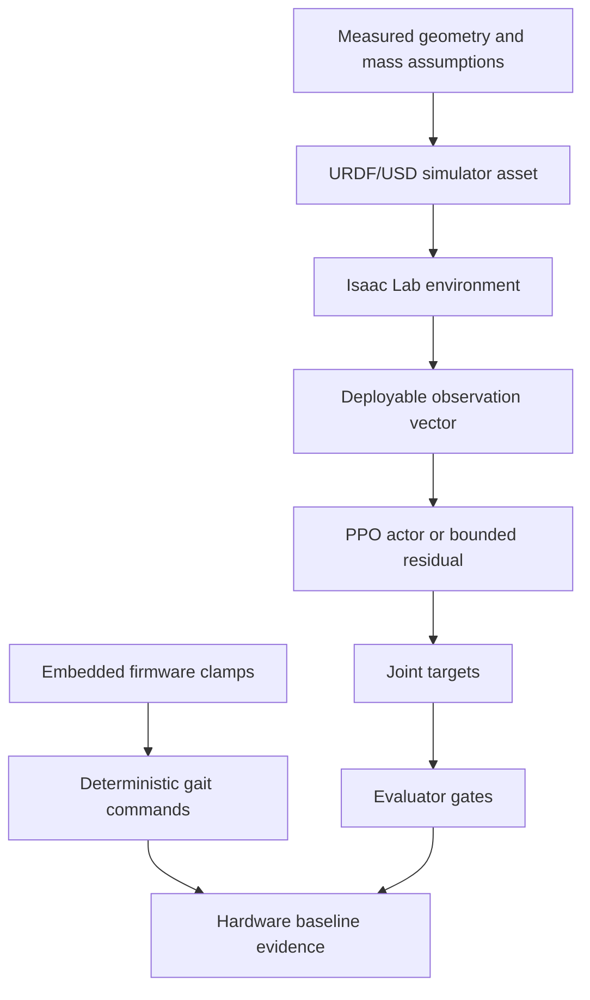

# Architecture

ARI combines a physical 18-DOF hexapod with a simulator-first learning stack.

## Hardware Layer

- Six legs, three joints per leg: coxa yaw, femur pitch, tibia pitch.
- Embedded controller sends bounded servo targets and reads foot-switch state.
- The deterministic hardware gait is separate from neural policy deployment. It is useful as a known, inspectable baseline and as a safety reference.

## Simulation Layer

Isaac Lab provides the articulation model, contact sensor readings, joint limits, torque/velocity constraints, randomized friction/mass conditions, and PPO rollouts. Simulation code is treated as test infrastructure, not as proof of hardware readiness by itself.

## Policy Boundary

The public evidence emphasizes deployable observations: IMU-derived angular rate and gravity, command inputs, phase, prior action, commanded-target joint proxies, and foot-switch contact bits. Privileged simulator-only state is not a valid hardware policy input.

## Data Flow

## Portfolio Snapshot

The files in `src/` and `config/` are representative, sanitized examples. They demonstrate geometry, observation contracts, evaluator logic, and configuration discipline without copying operational run trees, checkpoints, or machine-specific launch files.
