# ARI Build Evolution

This page documents the physical robot build using only public, sanitized media in this repository. It is a robot-build timeline, not a claim that learned policies have been deployed on hardware.

## Timeline

### Concept sketches

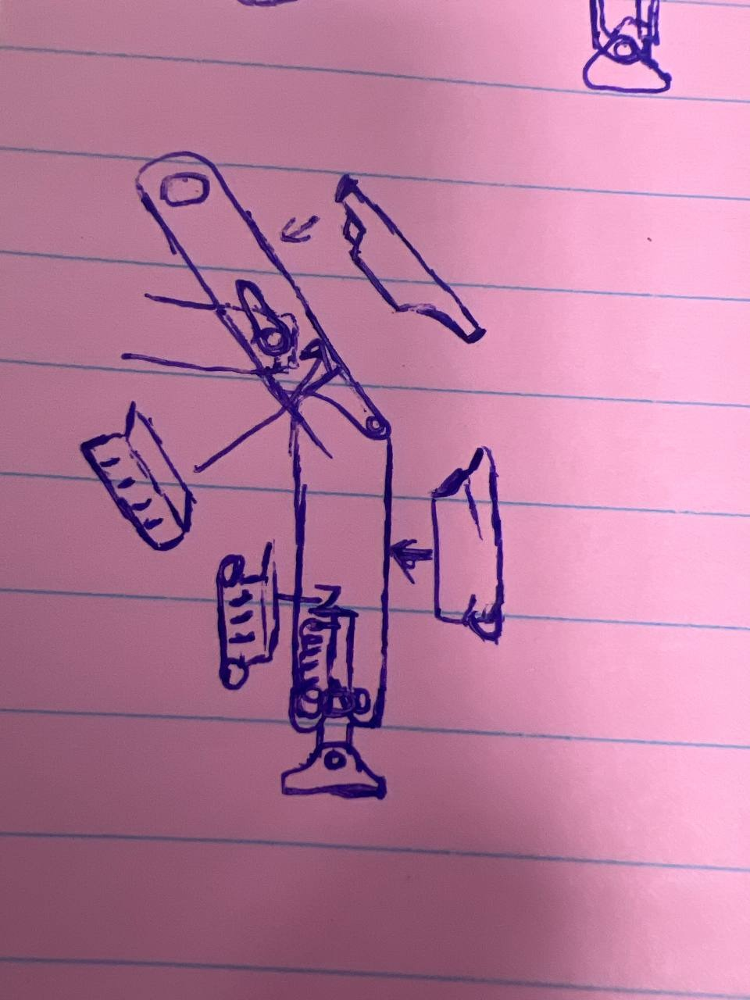

Early leg-assembly planning for an 18-DOF hexapod: six legs, three joints per leg, and a mechanical layout that could be fabricated and serviced.

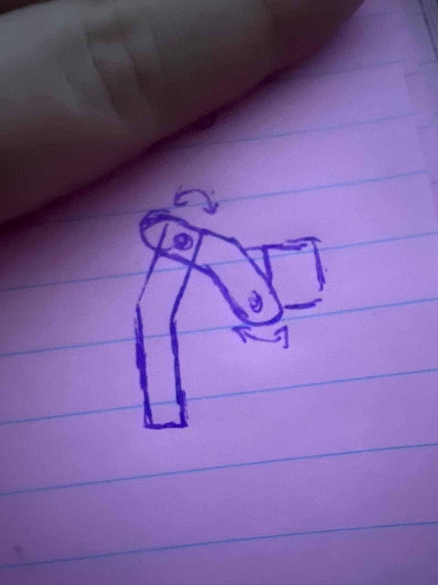

Linkage and joint-layout exploration before committing to the physical build.

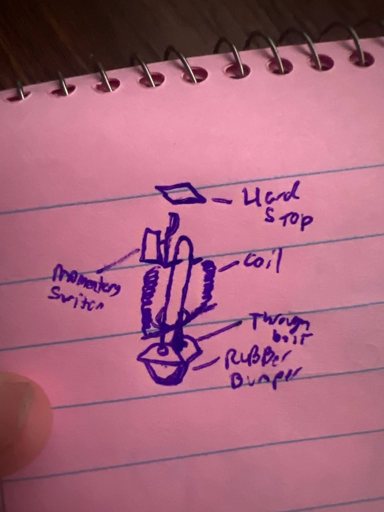

Foot-contact sensing concept. In the public repository this is shown only as build-planning evidence, not as a complete deployed sensor specification.

### Prototype 2 powered hardware

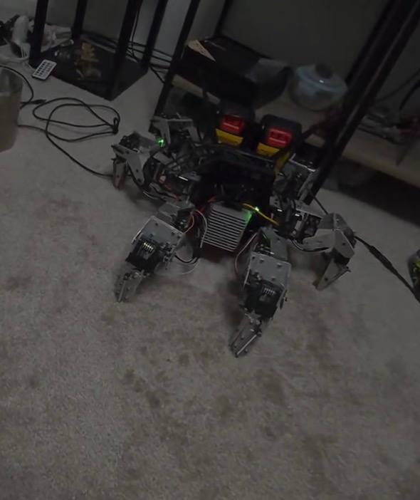

Prototype 2 brought the program from sketches into powered hardware: frame, servos, wiring, and control electronics arranged for bench testing.

### Current hardware and electronics

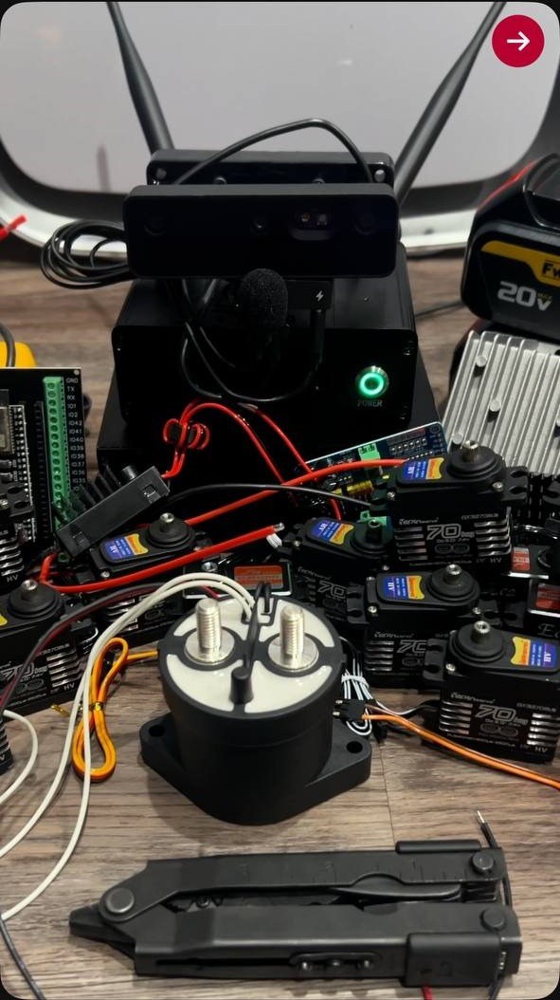

Current ARI hardware on the workbench. This is the physical platform used for deterministic scripted gait testing.

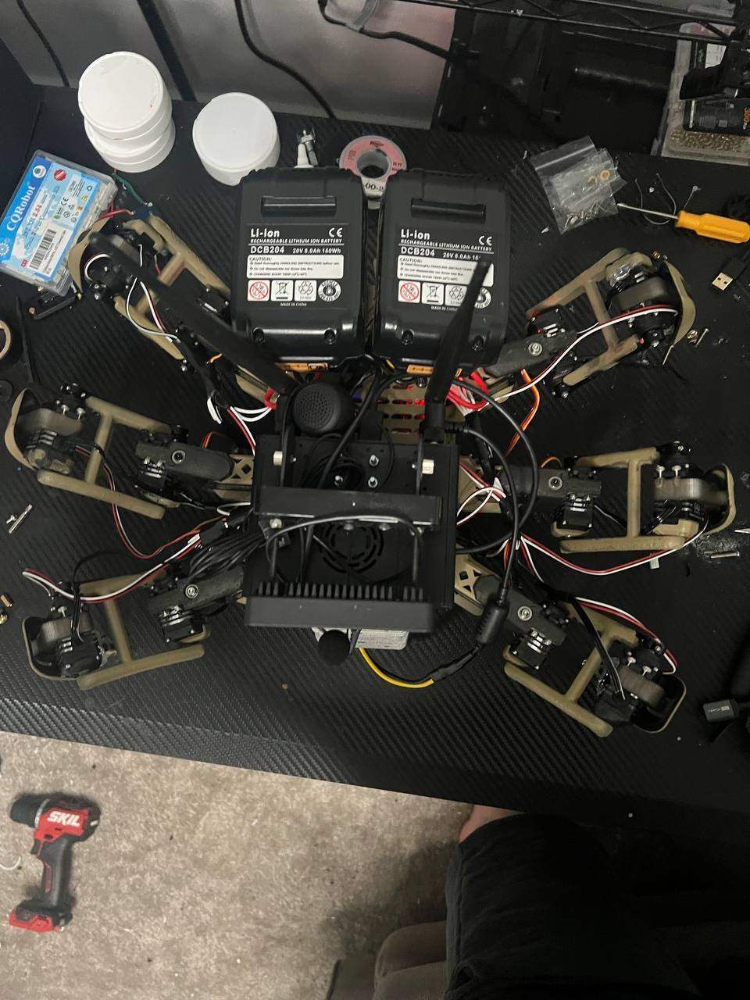

Top view showing the six-leg mechanical layout and the integration constraints that shape wiring, controller placement, and service access.

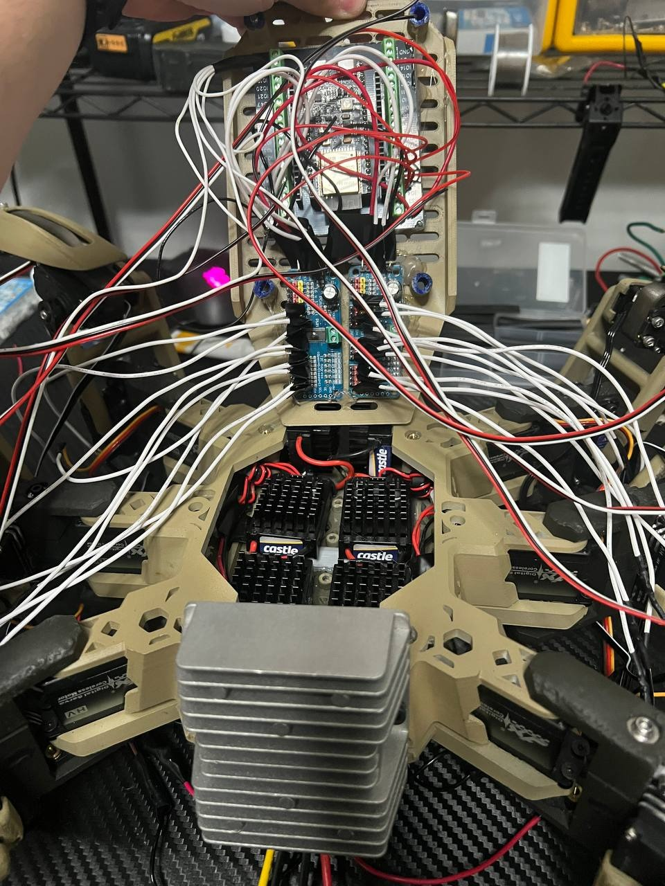

Power and control stack integration. Public documentation intentionally avoids exposing endpoints, identifiers, private paths, credentials, or operational configuration.

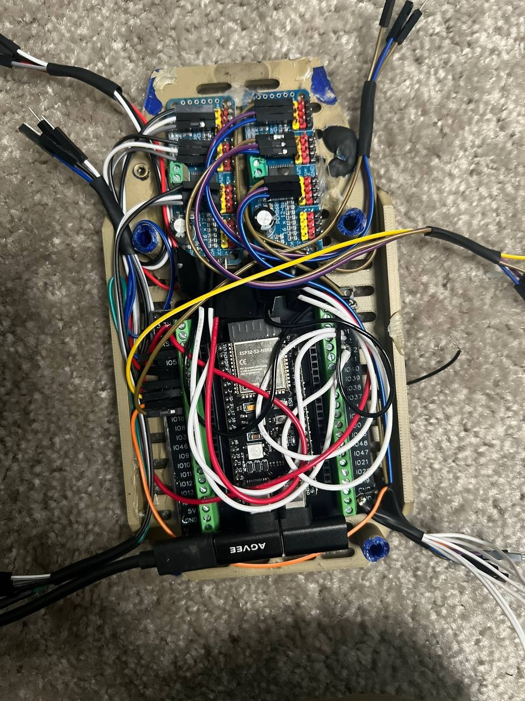

ESP32-class servo-control integration for bounded joint commands and hardware bring-up.

### Early gait development

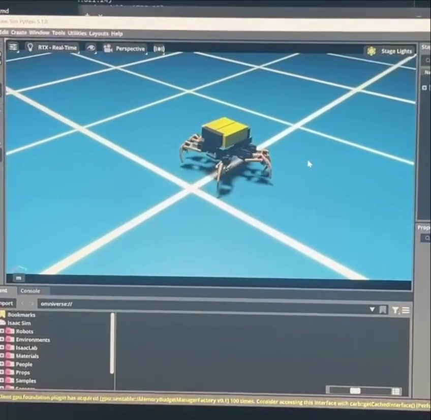

Early gait development and learning-to-walk footage: [learning-to-walk-progress.mp4](../media/build-evolution/05-learning-to-walk/learning-to-walk-progress.mp4). The controller is intentionally left unspecified because the public artifact does not support a narrower claim.

### Deterministic scripted physical walk

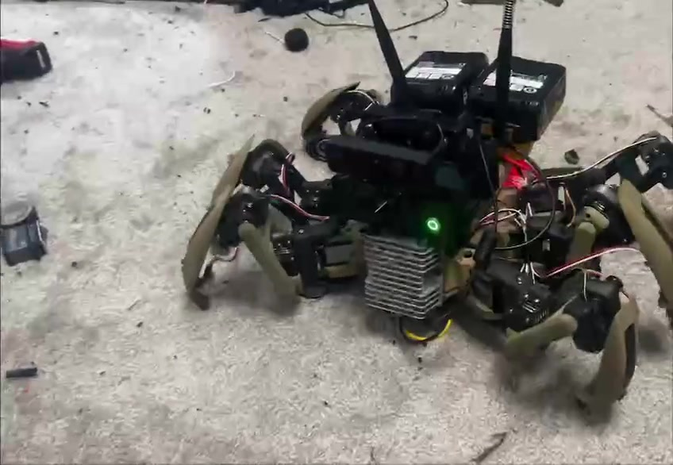

Deterministic scripted physical gait: [physical-scripted-walk-demo.mp4](../media/build-evolution/04-current-model/physical-scripted-walk-demo.mp4). This is hardware evidence for coordinated servo control, not a learned hardware policy.

### Simulator validation

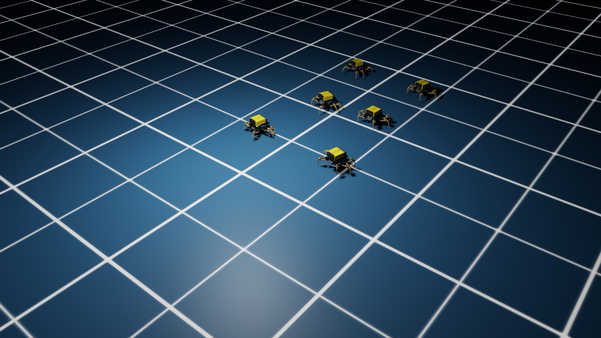

Run63 simulator-only legacy-axis locomotion evidence: [ari_run63_deploy_walk_0p25.mp4](../media/ari_run63_deploy_walk_0p25.mp4). This validates a deployable-observation policy in simulation under the legacy -X evaluator axis, backward relative to the physical chassis front. It is not physical-forward walking evidence and is not hardware deployment evidence.

## Portfolio Video

The build-story video is [media/portfolio/ari-build-story.mp4](../media/portfolio/ari-build-story.mp4), with poster image [media/portfolio/ari-build-story-poster.jpg](../media/portfolio/ari-build-story-poster.jpg). It sequences authentic media as concept sketches, Prototype 2, current hardware/electronics, early gait development, deterministic scripted physical walking, and simulator-only validation.
